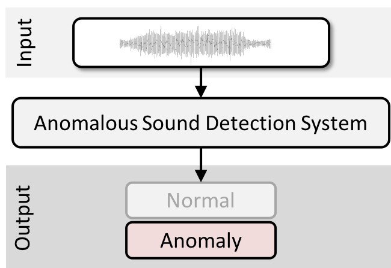
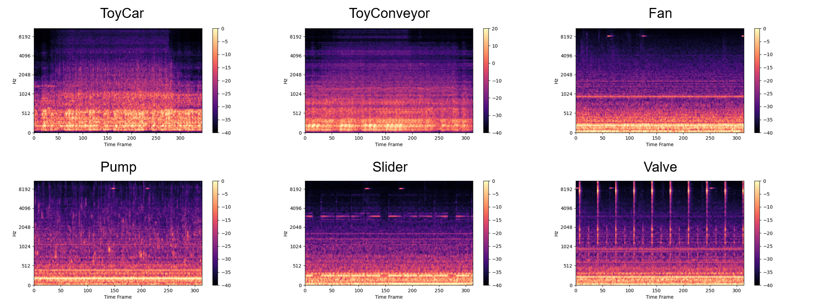
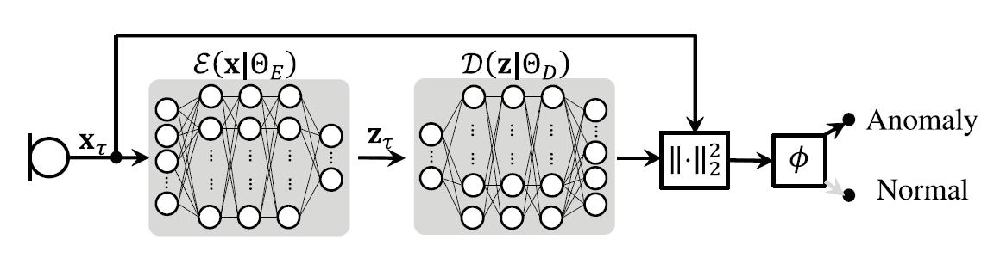

# **EE 488 AI Convergence Capstone Design : Anomaly Detection**
## **Unsupervised Detection of Anomalous Sounds for Machine Condition Monitoring (DCASE 2020 baseline)**

**Description**

Anomalous Sound Detection (ASD) is the task to identify whether the sound emmited from a target machine is normal or anomalous. 
The main challenge of this task is to detect unknown anomalous sounds under the condition that only normal sound samples have been provided as training data. 💻

**Dataset**

The data used for this task comprises part of **ToyADMOS** and the **MIMII dataset** consisting of the normal/anomalous operating sounds of six machine types. Each recording is a single-channel 10-sec length audio that includes both a target machine's operating sound and environmental noise. There are six machine types: `ToyCar`, `ToyConveyor`, `Fan`, `Pump`, `Slider`, and `Valve`, but in this example, we only use `valve` dataset.

**Baseline Model (Autoencoder)**

In this example, we use simple Autoencoder for anomaly detection. The input vector is compressed and reconstructed by two networks 𝓔 (which is called Encoder) and 𝓓 (which is called Decoder), respectively. Since 𝓔 and 𝓓 are trained to minimize reconstruction error of normal sounds, the reconstruction error would be small if input data 𝐱 is normal. Thus, the anomaly score is calculated as a reconstruction error, and when the error exceeds a pre-defined threshold 𝜙, the observation is identified as anomalous.

